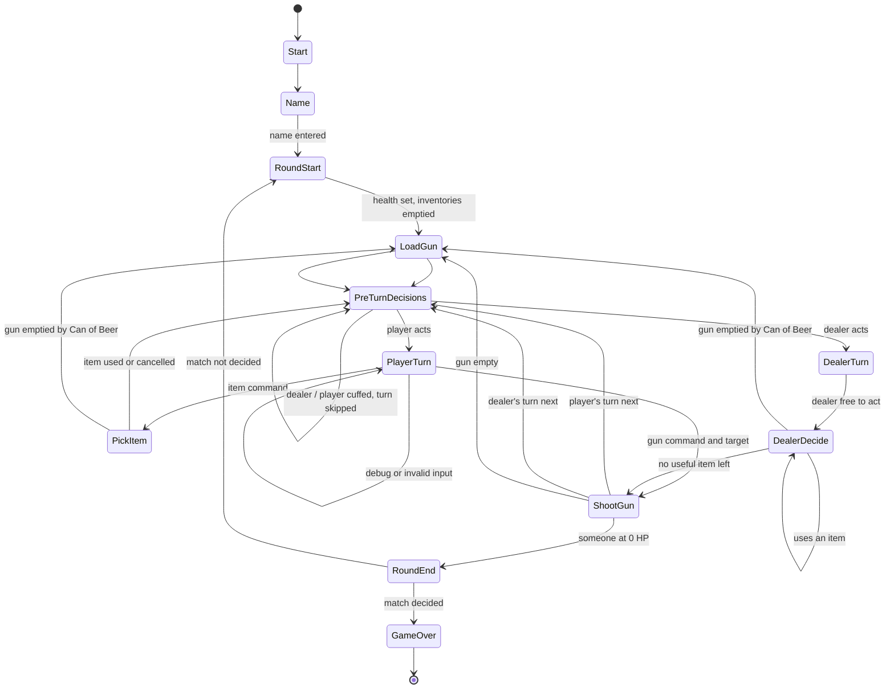

```mermaid
stateDiagram-v2
    [*] --> Start
    Start --> Name
    Name --> RoundStart : name entered
    RoundStart --> LoadGun : health set, inventories emptied
    LoadGun --> PreTurnDecisions
    LoadGun --> PreTurnDecisions
    PreTurnDecisions --> PlayerTurn : player acts
    PreTurnDecisions --> DealerTurn : dealer acts
    PlayerTurn --> PickItem : item command
    PlayerTurn --> ShootGun : gun command and target
    PlayerTurn --> PlayerTurn : debug or invalid input
    PickItem --> PreTurnDecisions : item used or cancelled
    PickItem --> LoadGun : gun emptied by Can of Beer
    DealerTurn --> DealerDecide : dealer free to act
    PreTurnDecisions --> PreTurnDecisions : dealer / player cuffed, turn skipped
    DealerDecide --> DealerDecide : uses an item
    DealerDecide --> ShootGun : no useful item left
    DealerDecide --> LoadGun : gun emptied by Can of Beer
    ShootGun --> PreTurnDecisions : player's turn next
    ShootGun --> PreTurnDecisions : dealer's turn next
    ShootGun --> LoadGun : gun empty
    ShootGun --> RoundEnd : someone at 0 HP
    RoundEnd --> RoundStart : match not decided
    RoundEnd --> GameOver : match decided
    GameOver --> [*]
```