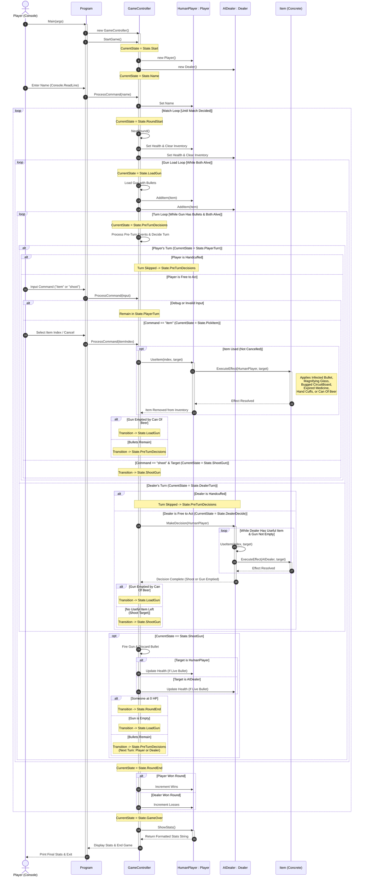

```mermaid
sequenceDiagram
    autonumber
    actor User as Player (Console)
    participant P as Program
    participant GC as GameController
    participant HP as HumanPlayer : Player
    participant D as AIDealer : Dealer
    participant I as Item (Concrete)

    %% Start & Name States
    User->>P: Main(args)
    activate P
    P->>GC: new GameController()
    activate GC
    P->>GC: StartGame()
    Note over GC: CurrentState = State.Start
    GC->>HP: new Player()
    GC->>D: new Dealer()
    Note over GC: CurrentState = State.Name
    
    User->>P: Enter Name (Console.ReadLine)
    P->>GC: ProcessCommand(name)
    GC->>HP: Set Name

    %% Match Loop (RoundStart -> RoundEnd)
    loop Match Loop [Until Match Decided]
        Note over GC: CurrentState = State.RoundStart
        GC->>GC: NextRound()
        GC->>HP: Set Health & Clear Inventory
        GC->>D: Set Health & Clear Inventory

        %% Gun Chamber Loop (LoadGun)
        loop Gun Load Loop [While Both Alive]
            Note over GC: CurrentState = State.LoadGun
            GC->>GC: Load Gun with Bullets
            GC->>HP: AddItem(Item)
            GC->>D: AddItem(Item)

            %% Turn Loop (PreTurnDecisions)
            loop Turn Loop [While Gun Has Bullets & Both Alive]
                Note over GC: CurrentState = State.PreTurnDecisions
                GC->>GC: Process Pre-Turn Events & Decide Turn

                alt Player's Turn (CurrentState = State.PlayerTurn)
                    alt Player is Handcuffed
                        Note over GC,HP: Turn Skipped -> State.PreTurnDecisions
                    else Player is Free to Act
                        User->>P: Input Command ("item" or "shoot")
                        P->>GC: ProcessCommand(input)

                        alt Debug or Invalid Input
                            Note over GC: Remain in State.PlayerTurn
                        else Command == "item" (CurrentState = State.PickItem)
                            User->>P: Select Item Index / Cancel
                            P->>GC: ProcessCommand(itemIndex)
                            opt Item Used (Not Cancelled)
                                GC->>HP: UseItem(index, target)
                                activate HP
                                HP->>I: ExecuteEffect(HumanPlayer, target)
                                activate I
                                Note right of I: Applies Infected Bullet,<br/>Magnifying Glass,<br/>Bugged CircuitBoard,<br/>Expired Medicine,<br/>Hand Cuffs, or Can Of Beer
                                I-->>HP: Effect Resolved
                                deactivate I
                                HP-->>GC: Item Removed from Inventory
                                deactivate HP
                            end
                            alt Gun Emptied by Can Of Beer
                                Note over GC: Transition -> State.LoadGun
                            else Bullets Remain
                                Note over GC: Transition -> State.PreTurnDecisions
                            end
                        else Command == "shoot" & Target (CurrentState = State.ShootGun)
                            Note over GC: Transition -> State.ShootGun
                        end
                    end

                else Dealer's Turn (CurrentState = State.DealerTurn)
                    alt Dealer is Handcuffed
                        Note over GC,D: Turn Skipped -> State.PreTurnDecisions
                    else Dealer is Free to Act (CurrentState = State.DealerDecide)
                        GC->>D: MakeDecision(HumanPlayer)
                        activate D
                        loop While Dealer Has Useful Item & Gun Not Empty
                            D->>D: UseItem(index, target)
                            D->>I: ExecuteEffect(AIDealer, target)
                            activate I
                            I-->>D: Effect Resolved
                            deactivate I
                        end
                        D-->>GC: Decision Complete (Shoot or Gun Emptied)
                        deactivate D

                        alt Gun Emptied by Can Of Beer
                            Note over GC: Transition -> State.LoadGun
                        else No Useful Item Left (Shoot Target)
                            Note over GC: Transition -> State.ShootGun
                        end
                    end
                end

                %% ShootGun Resolution
                opt CurrentState == State.ShootGun
                    GC->>GC: Fire Gun & Discard Bullet
                    alt Target is HumanPlayer
                        GC->>HP: Update Health (If Live Bullet)
                    else Target is AIDealer
                        GC->>D: Update Health (If Live Bullet)
                    end

                    alt Someone at 0 HP
                        Note over GC: Transition -> State.RoundEnd
                    else Gun is Empty
                        Note over GC: Transition -> State.LoadGun
                    else Bullets Remain
                        Note over GC: Transition -> State.PreTurnDecisions<br/>(Next Turn: Player or Dealer)
                    end
                end
            end
        end

        %% RoundEnd State
        Note over GC: CurrentState = State.RoundEnd
        alt Player Won Round
            GC->>HP: Increment Wins
        else Dealer Won Round
            GC->>HP: Increment Losses
        end
    end

    %% GameOver State
    Note over GC: CurrentState = State.GameOver
    GC->>HP: ShowStats()
    activate HP
    HP-->>GC: Return Formatted Stats String
    deactivate HP
    GC-->>P: Display Stats & End Game
    deactivate GC
    P-->>User: Print Final Stats & Exit
    deactivate P
```